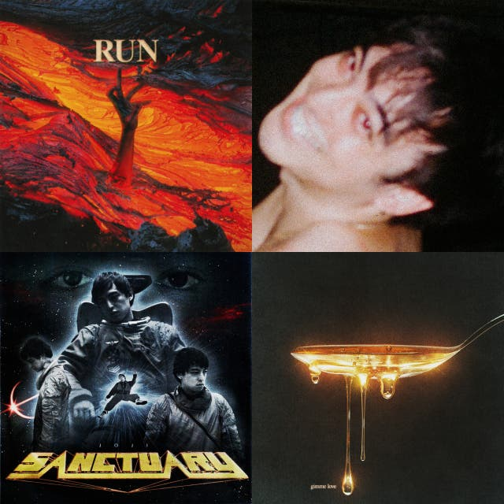

## Music
[start-desc]: #

[//]: # (Replace this line with a description persistent with the repository.)

[end-desc]: #

<a href="Top-level/songs.md"> <b>Top-level<b></a>|<a href="Another/songs.md"> <b>Another<b></a>|<a href="Rap"> <b>Rap<b></a>
:--:|:--:|:--:

